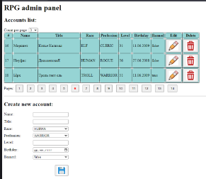

### Создаем админ панель для игроков rpg.
#### Создаем БД MySQL rpg и таблицу player в контейнере Docker.
#### Заполняем БД из скрипта init.sql.
#### Мапим сущность Player на таблицу в папке entity.
#### Прописываем репозиторий, сервис, контроллер с методами реализующие CRUD операции
Используются spring webmvc,hibernate,p6spy,log4j,thymeleaf,css,jstl,jackson,maven.

